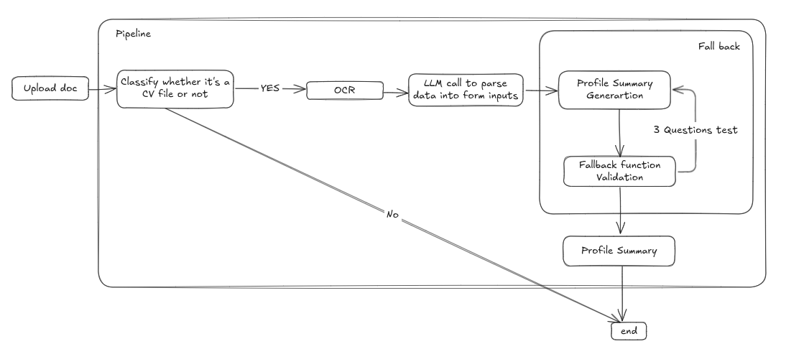

# FastAPI Career Profile Generator

A modular FastAPI application that:

- Parses uploaded CV files (PDF or image) into structured data using Tesseract OCR with Hugging Face fallback.
- Generates a professional profile summary, reasoning, relevant tags, and SEO keywords via OpenAI's structured JSON-Schema outputs.
- Automatically validates the generated summary against a set of questions and retries if validation fails.

## Pipeline


## Features

- **CV Parsing**: Extract name, experience, education, skills, and contact information from PDF or image resumes.
- **Profile Generation**: Create a clear summary, reasoning, tags, and SEO keywords using OpenAI's preview client with JSON-Schema-based prompts.
- **Automated Validation**: Ask the model to answer three yes/no questions about the generated summary; automatically retry generation up to 2 times if any check fails.
- **Modular Codebase**: Clean separation of concerns across configuration, schemas, OCR utilities, and routers.
- **Structured Responses**: All LLM outputs conform to explicit JSON Schemas and are validated by Pydantic models.

## Building Robust AI Systems

What sets truly effective AI systems apart isn't just the base model quality, but the engineering around it. This application demonstrates that robust AI systems are built through:

- **Validation layers** that automatically verify output quality and trigger regeneration when needed
- **Fallback mechanisms** (like our Tesseract → Hugging Face OCR pipeline) that ensure reliability even when primary methods fail
- **Structured output enforcement** through JSON schemas that guarantee consistent, parse-able responses
- **Clear separation of concerns** allowing each component to excel at its specific task

These resilience patterns make the difference between fragile AI demos and production-ready applications that deliver consistent, high-quality results in real-world scenarios.

## Structured Output

This application leverages OpenAI's structured output capabilities through JSON Schema definitions. Rather than parsing free-form text responses, we:

1. Define precise JSON structures for each output type (profile summary, validation answers, etc.)
2. Send these schemas to the API as part of the prompt
3. Receive responses that conform exactly to our predefined structure

This approach eliminates the need for complex regex parsing or brittle extraction logic, dramatically improving reliability. The model outputs data in exactly the format our application expects, enabling seamless integration with our validation pipeline and database storage. By constraining the model to produce only valid structured data, we reduce errors and ensure consistency across all generated profiles.

## Requirements

- Python 3.10+
- Tesseract OCR installed (for local OCR)
- A Hugging Face API token (for OCR fallback)
- OpenAI preview client (`openai>=0.27.0`)
- This project requires [Poppler](https://github.com/oschwartz10612/poppler-windows/releases) to be installed for PDF support via `pdf2image`.

## Installation

1. Clone the repository:
   ```bash
   git clone https://github.com/yourusername/fastapi-career-app.git
   cd fastapi-career-app
   ```

2. Create and activate a virtual environment:
   ```bash
   python -m venv .venv
   source .venv/bin/activate     # Linux/macOS
   .\.venv\Scripts\activate    # Windows
   ```

3. Install dependencies:
   ```bash
   pip install -r requirements.txt
   ```

4. Set up environment variables in a `.env` file:
   ```env
   OPENAI_API_KEY=your_openai_key
   OPENAI_MODEL=gpt-4o-mini        # or another supported model
   HF_API_TOKEN=your_huggingface_token
   ```

5. Ensure Tesseract is accessible (update the path in `app/ocr_utils.py` if needed).
    start app :uvicorn app.main:app --reload
## Project Structure

```
fastapi_career_app/
├── app/
│   ├── __init__.py
│   ├── main.py              # FastAPI app & template route
│   ├── config.py            # Env loading & client setup
│   ├── schemas.py           # Pydantic models & JSON Schemas
│   ├── ocr_utils.py         # Tesseract + HF OCR helpers
│   └── routers/
│       ├── __init__.py
│       ├── cv_router.py     # /process-cv/ endpoint
│       └── profile_router.py# /generate endpoint with auto-validation
├── templates/
│   └── index.html           # Jinja2 form template
├── static/
│   └── style.css            # Custom styles
├── requirements.txt
└── README.md
```

## Usage

Start the server from the project root:
```bash
uvicorn app.main:app --reload --port 8000
```

- **GET /**
  - Renders the main form (upload CV or fill in profile fields).
  - Returns an HTML form.

- **POST /process-cv/**
  - Accepts a file (`multipart/form-data`).
  - Returns a JSON object matching the `ProfileForm` schema.

- **POST /generate**
  - Accepts form fields: `name`, `experience`, `education`, `skills`, `contact`.
  - Generates and validates a profile summary. Retries up to 2 times if validation fails.
  - Returns a JSON object matching the `ProfileSummary` schema.

## Example

```bash
# Generate summary from form data:
curl -X POST http://127.0.0.1:8000/generate \
  -F name="Jane Doe" \
  -F experience="5 years in software engineering" \
  -F education="BSc Computer Science" \
  -F skills="Python, FastAPI, Docker" \
  -F contact="jane@example.com"
```

Response:
```json
{
  "summary": "...",
  "reasoning": "...",
  "tags": ["Backend Development", "API Design", "Cloud Engineering"],
  "seo_keywords": ["FastAPI developer", "Python backend engineer"]
}
```

## Logging

- `INFO` logs for each call to generation and validation.
- `DEBUG` logs for raw and parsed LLM outputs.
- `WARNING` when validation fails and regeneration occurs.